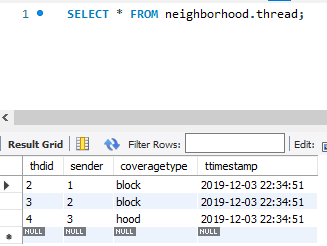
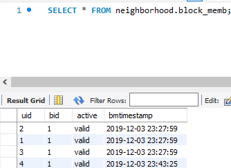
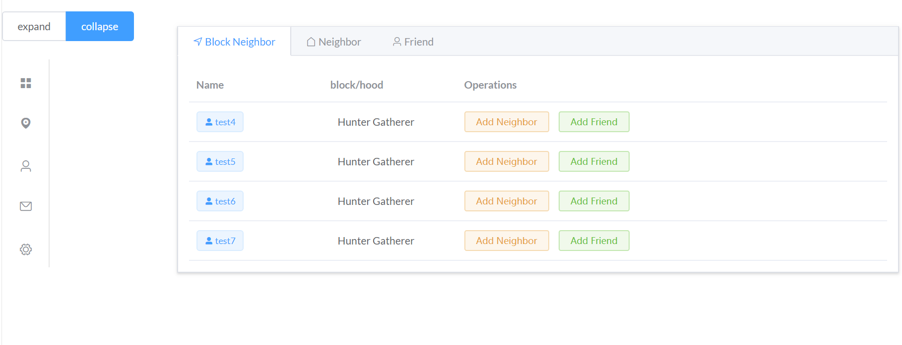

# Principle of Database, 2019 Fall, Project 1
This project is the final project of `Principle of Database`. This project allows people to communicate with others in their neighborhood similar to 'http://nextdoor.com'. That is, people should be able to sign up for the service and specify where they live; they can then send and receive messages to other users living close by, and participate in discussions with those users.

***
	
|Student|Backend| Frontend| Time|
|---|---|---|---
|Hang Yu|PHP(Laravel)| Vue.js | 12/15/2019

    
****
## Index
* [ER Model](##%20ER%20Model%20Design)
    * [Friendship](###%20Friend%20Relationship%20and%20Neighbor%20Relationship
)
    * [User information](###User%20Profile%20and%20Log%20Information)
    * [Address](###Address%20Presentation)
    * [Block Membership](###Block%20Membership)
    * [Message](###Message%20Control)
* [Constraints](#%20Constraints%20(trigger))

* [Bahevior Simulation](##Behavior%20Simulation)
    * [Joining](###Joining)
    * [Content Posting](###Content%20Posting)
    * [Friendship](###Friendship)
    * [Browse and Search Messages](###Browse%20and%20Search%20Messages)

* [Testing](##Testing)

* [Project 2](##%20Project%202%20(revised))
****
## ER Model Design
This design uses 13 entities and their relationships to support the functionality of neighborbood interaction behaviors. The entities includes `user`, `profile`, `address`, `locality`, `block_req`, `block_memb`, `message`, `init_msg`, `thread`, `msg_memb`, `thread`, `localmsg`; important relationships consist of `approve`, `friend`, `neighbor`, `create`, etc.


<!--  -->

### Relational Model
**User(<u>uid</u>, account, password)**

**Address(<u>addrid</u>, name, addresstext, street, city, state, country, latitude, longitude)**

**Profile(<u>uid</u>, name, address, phone, description)**  
Note: *uid* references *User* on *uid*, *address* references *Address* on *addrid*.

**Locality(<u>lid</u>, ltype, name, description,  southwest, northeast)**         
Note: *southwest*, *northeast* reference *Address* on *addrid*

**Hood_block(<u>hid, bid</u>)**         
Note: *hid*, *bid* reference *Locality* on *lid*

**Block_memb(<u>uid</u>, lid, active, bmtimestamp)**    
Note: *uid* references *User* on *uid*, *lid* references *Locality* on *lid*.

**BLock_req(<u>uid, lid, brtimestamp</u>, numb4apv, status)**            
Note: *uid* references *User* on *uid*, *lid* references *Locality* on *lid*.

**Block_apv(<u>uid, lid, brtimestamp, apverid</u>, apvtime)**      
Note:*apverid* references *User* on *uid*, *uid, lid, brtimestamp* references *Block_req* on *udi, lid, brtimestamp*

**Friend(<u>uid1, uid2, reqtime</u>, restime, status)**     
Note: *uid1* references *User* on *uid*, *uid2* references *User* on *uid*.

**Neighbor(<u>uid1, uid2</u>, nbtime)**     
Note: *uid1* references *User* on *uid*, *uid2* references *User* on *uid*.

**Loginfo(<u>uid, logintime</u>, logouttime)**      
Note: *uid* references *User* on *uid*.

**Msg_memb(<u>uid, thdid, jointime</u>, leavetime, lastmsg)**      
Note: *uid* references *User* on *uid*, *thdid* references *thread* on thdid, *lastmsg* references *Message* on *mid*.

**Message(<u>mid, thdid</u>, author, mtimestamp, title, text, address, replyto)**      
Note: *author* references *User* on *uid*, *thdid* references *Thread* on thdid, *address* references *Address* on addrid, *replyto* references *Message* on *mid*.


**Thread(<u>thdid</u>, sender, coveragetype, ttimestamp)**  


**Localmsg(<u>lid, thdid, ltimestamp</u>, title, text, mid)**      
Note: *lid* references *Locality* on lid, *thdid* references *thread* on *thdid*.

[Back to top](##%20Index)

### Constraints (trigger)
1. When user's request to join a block receive 3 approvements, he should become a member of that block and status of his request would be marked as valid.
``` SQL
    CREATE  TRIGGER `neighborhood`.`reduce_req_count` AFTER INSERT ON `block_apv` FOR EACH ROW
    BEGIN
        declare gap int;
        update block_req
            set numb4apv=numb4apv-1, status=case numb4apv when 0 then 'approved' else 'processing'end
            where uid=new.uid and lid=new.lid and brtimestamp=new.brtimestamp;
        select numb4apv into gap
            from block_req where uid=new.uid and lid=new.lid and brtimestamp=new.brtimestamp;
        if gap=0 then
            insert into block_memb values( new.uid, new.lid, "valid", now());
        end if;
    END
```
2. When a locality is established, it should create its own thread to send broadcast message to every member.
``` SQL
    delimiter $$
    create trigger create_local_thread
    after insert on locality
    for each row
    begin
        insert into thread (`sender`, `coveragetype`, `ttimestamp`)  values(new.lid, new.ltype, now());
    end$$
    delimiter ;
```
3. When a user successfully joins a block or hood, he would automatically join the blocks broadcast thread. And the locality would send to all of the member an welcome notification. 
```SQL
    delimiter $$
    create trigger join_local_thread_and_welcom
    after insert on block_memb
    for each row
    begin
        declare tid int;
        declare uname varchar(45);
        # join local thread
        select distinct thdid into tid
            from thread t, locality l
            where coveragetype=l.ltype and t.sender=l.lid;
        insert into msg_memb values(new.uid, tid, now(), null, null);
        # locality send welcome notification
        select account into uname
            from profile 
            where uid=new.uid;
        insert into localmsg values(new.bid, tid, now(), "Welcome a new member:"+uname, "user:"+new.uid);
    end$$
    delimiter ;
```
Additionally, when a user join one block, he will automatically join that hood.
And since MySQL doesn't support trigger to modify the invoking statements, the check and join operation would be implemented in the application level.
```SQL
    # join the hood if this one is a block
    select l.ltype into btype
        from locality l where new.bid=l.lid;
    if btype="block" then
        select hb.hid into hid
            from hood_block hb where hb.bid=new.bid;
        insert into block_memb values(new.uid, hid, "valid", now());
    end if;
```

### Functions and stored procedures
Since most of the work should be done in the application level rather than the procedure level, they are implemented in the backend server in proj 2.

[Back to top](##%20Index)

----

Below will justify the correctness from the terms of different functional components as well as the reason of this design.

### Friend Relationship and Neighbor Relationship
As is mentioned in the requierments, friend relationship is hold between two user only when one has accepted another's friend request. Thus the `friend` schemas only needs to store all friend requests and once an request is approved, update that request filling in the 'restime' and 'status' field. 
If we just want to check one's all friends, we can just check the status field whether it is equal to "approved".

Since neighbor only need one user to confirm the relationship, it use `neighbor` shcema to maintain the simplex requirement.
<p align="center"></p>

### User Profile and Log Information
User' s information includes' his account and password, as well as his profile. Since `uid` is joined frequently, a seperate `user` table should be seperated from `profile`. Also, all user sign-up and sign-in information should be stored in `loginfor` schema.
<p align="center"></p>

### Address Presentation
To effectively inhance the presentation of address entity, `address` schema assigns each appeared loaction with an unique id and allow several attributes binding with it like `street`, `city`, `state` and more importantly `longitude` and `latitude`.

There are three entities that need the presentation of an address, locality, user profile and message. In this design, each usage of a new address would create an new entry in the `address` table and then other table only needs to holds an id referencing to that entry.

Any entity that needs a point representation of an address is defined as an `location`. And its subclass would automatically inherit the 'address' attribute. In this case, `message` and `profile` holds an 'address' attribute. The other entities like hoods and blocks are different from 'location' entity since they need two address points to determine an rectangle area. Thus they holds two `addrid` foreign key. Because their is no apparent difference between hoods and blocks, I just define them as 'locality' and use another relationship `hood_block` to recored which block belongs to which hood.

<p align="center"></p>

### Block Membership
Not all user should be member of one block, so the `block_memb` table is necessary to record which user belongs to which block. Due to the rule that 'After three member of one block approve one's request, he can join the club', schema `block_req` records all block member's request and status of the request including whether it's approved. The attribute 'numb4apv' indicates at least how many approvement this request needs, and the 'status' attribute records whether it's approved or invalid due to user's moving out.  And another schema `block_apv` continas the records of approvment by block members. Once three member approve one request, the user would gain an record in `block_memb` indicating that he has been a member of that block.

<p align="center"></p>

### Message Control
An important part of the backend system is about message control. Message in this system is an email-like entity. 'Message' has basic attributes including 'author', 'thdid', 'title', 'text' and timestamp and it's own 'mid' identifying them in a thread. Both thread id and message id are necessary to identify an message, so message is a **weak** entity. Multiple messages are concatenated by thread. Messages on the same thread are accessible to all it's recipient group members and orginized in time sequence. 'Thread' has its id, a timestamp and a type field. 


<p align="center"></p>

Once a thread is created, a recepient group is also created. Contained in the thread, it identifies a group of users as receivers of messages of some thread. It records the initializer of the thread, the type of coverage and a timestamp. Another entity `msg_memb` records all the members of a recepient group. It serves more than a relationship between `user` and `thread` because a member may join the same group and leave several time due to moving house. Also, `msg_memb` has a lastmsg field, referencing 'mid' in `message`, to maintain the last access to the messages in that thread. This is useful for the 'unread' function. When a thread is initialized, a thread entity, recepient group as well as all it' s members will be created.

A message could serve as an reply to another message, so `message` holds an 'replyto' fileds. If it's the host message, the field woule be null. It's a joined representation of entity `message` and relationship `reply`.

A thread could be initiated by a locality or a user: if it is initiated by a locaity, the coveragetype woule be the ltype of locality, 'hood' or 'block' which means this thread is used by locality to send broadcast message. If it is created by the user, then the coveragetype could be 'uhood': a user sends to all his hoods; 'ublock': a user sends to all his block members; 'friend': a user directs to all his friends; 'neighbor': a user directs to all his neighbors; 'group': a user sends to all his chosen friends or neighbors;


There are also other type of message that is sent by locality rather than a user. Like that when a new user join some locality, the hood or the block may send a broadcast message to all its member. It' s implemented in a similar way. I use `localmsg` to record which locality would send message some recepient group.
[Back to top](##%20Index)

****
## Behavior Simulation
Use SQL query to simulate user behavior in different scenarios.

### Joining
Below process shows basic operation when a new user join a community.
#### User sign up
System would check firstly whether the account has been registered before.
```SQL
    select count(*) from User
    where account="account_str"
```
If returned answer is above zero, then user must reenter a different user name. While all user input are valid, an user as well as userid would be created.
```SQL
    insert into User values("account_str", "password_str");
    insert into Profile values(LAST_INSERT_ID(), "name_str", "address_str", "phone_str", "description_str");
```

#### Apply for member of block
User with `$uid` need to first make request to join one block with `$bid`
```SQL
    insert into block_req values($uid, $bid, now(), 3, "processing")
```
After that when any member with $apverid approve that join request, `block_apv` would record the case and execute below scripts:
```SQL
    insert into block_apv values($uid, $apverid, now())
    update block_req
        set numb4apv = case numb4apv when 0 then 0 else numb4apv-1 end
        where uid=$uid and lid=$bid and status="processing"
```
Thus when we have a request that have been approved 3 times, the 'numb4apv' field would be 0 and its status would still be 'processing'. Then we use trigger to help create membership for that block in that case, i.e. when a tuple has "processing" status and it's "numb4apv" is zero, execute the [`apv_block_req`](###%20Constraints%20(trigger)) trigger.

#### Edit user profile
Since user profile are created when they signed up, they can edit their profile replacing null value with frest input. When user with `uid` inputs valid `$name`, `$phone`, `$desc`, address text and choose a point on the map, it would automatically add a new address tuple and update the profile infomation.  
```SQL
    insert into address values($address_name, $address_text, $street, $city, $state, $country, $latitude, $longitude)
    update profile
        set name=$name and address=last_insert_id() and phone=$phone and description=$desc
        where uid=$uid
```

### Content Posting
Below implements what happends when a user starts a new thread by posting an initial message, and replies to a message.

#### Create a thread
User with `$uid` needs to create a thread and a recepient group to send message. He would choose a group of people as recepient member including himself who will further receive the message.
Assume thread has type `group` which indicates that this thread faces his chosen friends.

Firstly a thread is created with returned thread id `$thdid`
```SQL
    insert into thread values($uid, "group", now())
    select last_insert_id()
```
Then the initial message content woule be stored in the `message` table, assume the message don't have any address information (actually if it has address information, it would increase an address record and hold its id reference). 

```SQL
    insert into message values(1, $uid, now(), $title, $text, null)
```

Then all chosen user will be invited to the thread, for all  `$invitee` invited, we need to join them to the message group members.
```SQL
    insert into msg_memb values($invitee, $thdid, now(), null, 1)
```
#### Visit a thread
When a user `$uid` visit messages in thread `$thdid`, the inforamtion respecting unread messages would be updated
```SQL
    update msg_memb 
        set lastmsg=(select max(mid) from message where thdid=$thdid)
        where thdid=$thdid and uid=$thdid and leavetime is null
```
#### Reply a messge
When a user `$uid1` would like to reply a message `$mid` in the thread `$thdid`. He would create a message like
```SQL
    insert into message values($uid1, now(), $title, $text, $mid)
```
Then the message would assign a preamble `$mid`.

### Friendship
Users can add or accept someone as their friend or neighbor, and list all their current friends and neighbors.
#### Friend request and approvement
User `$uid1` needs to make a request to someone `$uid2` to become his friend:
```SQL
    insert into friend values($uid1, $uid2, now(), null, "proc essing");
```
Then once $uid2 log in the system, he will see the friend request and either approve it or refuse it. If he approve it, then the response time and status of request would change.
``` SQL
    update friend
    set status="approved" and restime=now()
    where uid1=$uid1 and uid2=$uid2 and status="processing"
```
Or he could just refuse it.
``` SQL
    update friend
    set status="refused" and restime=now()
    where uid1=$uid1 and uid2=$uid2 and status="processing"
```
To see `$uid` 's all friend,
``` SQL
    select uid2 from friend
    where status="approved" and uid1=$uid1
```
#### Neighbor 
Since neighbor relationship doesn't need both side to approve, if `$uid1` want to make `$uid2` his neighbot. He would 
``` SQL
    insert into neighbor values($uid1, $uid2, now())
```
And he can see all his neighbors
``` SQL
    select uid2 from neighbor
    where uid1=$uid1
```

### Browse and Search Messages
Useful queries when a user accesses content. 
#### Unread message
List all threads in a user's block feed that have new messages since the last time the user accessed the system.
``` SQL
    select distinct t.thdid, t.title
    from thread t natural join msg_memb mm
    where t.coveragetype="ublock" 
        and mm.uid=$uid 
        and lastmsg <
    (select max(mid) from message where thdid=t.thdid) 
        and leavetime is null
```

All threads in his friend feed that have unread messages.
``` SQL
    select distinct t.thdid, t.title
    from thread t natural join msg_memb mm
    where t.coveragetype="friend" 
        and mm.uid=$uid 
        and lastmsg <
    (select max(mid) from message where thdid=t.thdid) 
        and leavetime is null
```
#### Keyword Search
All messages containing the words `$keyword` across all feeds that the user can access.
``` SQL
    select distinct t.title, m.title, m.text
    from thread t join msg_memb mm on t.thdid=mm.thdid join message m on m.thdid=t.thdid
    where mm.uid=$uid
        and ((mm.leavetime is null and m.mtimestamp>mm.jointime) or (mm.leavetime is not null and m.mtimestamp between mm.jointime and mm.leavetime))
        and m.text like "%$keyword%"
```
### Moved out
Another interesting case is that a member may move out of the original block into another. The process of joining a new block is discussed before. Below focus on the process of leaving a block.

First the membership of a block should be set 'outdated', so that any further block feed notification or member join request would ignore the moved-out member.
``` SQL
    update block_memb
    set active="outdated"
    where uid=$uid and bid=$bid and active="valid" 
```
Then their membership as recepients in group communication session should also be marked so that after they leave they cannot check newer message on that thread until they rejoin the orignal block.
``` SQL
    update msg_member 
    set leavetime=now()
    where uid=$uid and leavetime is null
```
and the two phase is encapsulated in function `move_out`

[Back to top](##%20Index)
****
## Testing
Firstly, I populate schema `address`, `user` and `profile` some sample data for they are referenced mostly by other table.

address | user | profile
- | - | -
 | | 

Now the `locality` is empty as well as the `thread` table.
Then create 2 blocks and a hood in the `locality`, with one block contained in one hood.It can be seen that thread for broadcast would be automatically created in the `thread` table via `create_local_thread` trigger.
locality | hood_block | thread
- | - | -
 | |  

Then add three members to block 1. We can see that membership between thread and user has already been established and the block 1 sends out three broadcast message to the thread automatically.
block_memb | msg_memb | localmsg
- | - | -
 | |  

Now user 4 make a request to join the block 1 which has already 3 members, then let 3 of them all approve that request.
At last we can see that the request is approved and the user 4 is admitted as a block member.

block_req | block_apv | block_req after| block_memb
- | - | - | -
 |`   |  | 

[Back to top](##%20Index)

----
# Project 2 (revised)
## Environment
### Prerequisite
Backend dependencies:
- MySQL 5.7.26
- PHP 7.2.18
- Laravel 1.0
- Apache 2.4.39

Frontend dependencies:
- Bootstrap 3.3.7
- Vue 2.1.10
- Element-UI 2.13.0

Database Configuration:
- port 3309
- schema 'neighborhood'
- passport {'root':''}

Map API:
- Google Map

To run the project, it's necessary to run the php server:
```
    php -S localhost:port
```
Then compile the Vue scripts (.vue and .scss) with npm ('watch' will automatically compile):
```
    npm run watch
```
Then the website can be visited at [http://localhost:(port)/dbproj/public/](http://localhost/dbproj/public/).

----
## Functionality
This project implemented a fullstack website from frontend to database backend design and code implementation. This websit allow user to register, login, and apply to become a member of some block or hood, then with membership he could create threads of messages and interact with other members and even approve other's request to join the block. HTe interaction includes friend chat, view and reply to other's message and check all the location-relative messages on the map. The website provides 5 action modules: 'search', 'locality membership', 'message', 'relationship' and 'account management'.

### Search
Search function is located in the homepage. User can go throught a keywork search for a glampse of his message. The search type consists of 'message' search, which enables searching all his history messages like group messages, localized broadcast, locality notifications and even friend/neighbor chats. Another type 'user' enables user to search another user in all his friends and neighbors.


### Community
'Community' module support user to join a locality, make join requests and approve them and check the status of his locality. At the home of the community page, if the user have not yet joined any locality, he could see a list of available blocks and hoods as well as their information and geography. 


Otherwise, this page would give a simple view of his joined block or hood and he could choose to quit the block. The quit would be recorded in the schema `block_memb` with `leavetime` and `status` attribute.


Block member could also approve other's join request in the `community_join` page, he could not see his request once he has become a member of some block. On the contrary, if one is not a member of any block, then he could not approve any request and can view status of his join request on the left side.
community-join page of member | community-join page of non-member 
- | - 
 | 

Also, since a man could quit his locality several times, he can check his locality history in the community-history page, which shows in the form of timeline.
 

### Relationship
When use become a member of some locality, he could choose to add any of them as his friend or his neighbor. User can directly contact with his neighbors and friends, make friend request and can ignore or accept friend requests.

The first tab lists all available users in the same block with user 'ee' whom he could send friend request and neighbor requests to. He can check who is his neighbor as well as of whom he is neighbor in the second 'Neighbor' tab.
Candidate Neighbor| Actually Neighbor
- | - 
 | 

He could check his friend requests and receive other's requests in the friend tab. Also if they are approved he could see all his friends in the left side.

Friend Response| Friend Request
- | - 
 | 

The chating issue would be discussed in the message section.

### Message
User can direct message to his friends, neighbors, block members and reply to the message. The message is associated in the form of thread. Usually a message contians a title, message text, creator, timestamp and even address information including it's geographic location. 

Their are four types of message: 
1.  Chating message: this type of message can be seen from friend chating messages. It usually do not include address infomation and even dont' have title ofr its text is the core aprt. 
2. Group message: this type of message is from that one sender initilizes a group containing his chosen neighbors and friends and send messages on that thread visible to everyone in that group.
3. Broadcast message: this type of message if that one can send message to all members in the same block or hood
4. Locality notification: this type of message if send by locality. It's address is fixed and cannot be replied. Welcome letter is an example.

In the first page user can take a glimpse of the latest messages in the recent 7 days. These is from all the group messages, broadcast messages and localized notification.
 

In the send page user can view the last three type of messages. The group messages is organized in threads an user are only accessible to his own groups of threads. Since there are only one thread for broadcast and notification for one user, they are shown in timeline form.
Broadcast Message | Notification Message  
- | - 
 | 

In the first tab, user could view the thread of a message in the rightside drawer. It will show the group members in tag groups and messages in the timeline. If some messages replies to another message, it would shown with indent and shadow color like re:email.

Group Message | View Thread Message  
- | - 
 | 

User could start a new group at the group page.
If he is creating the initializing message, he would choosen group members of his relative users. He could choose location of the message. A message could have 4 types of address: chosen from map, from the user's profile, from the current location and no address. If the message is a reply message, its title would be 'RE:' concatnating the title it replys to.

Init Group Message | Reply Message 
- | - 
 | 

Also user can chat with friend. Chat message is short and frequent. It's realtime interaction with two end user. It's implemented by polling ajax.


All recent message can be included in a map view showing the location of each message as well as infobox showing its content. User can check them on the map interface.


### Account Management
User need to login to use the website service, and user's account status would be managed by session machinism, i.e. once user sign in the system, the browser would memorize his account avoiding repeated input password, and the session would timeout after peroids. Then user would be redirect to the welcome page. If someone does not have an account, he could regist with email as his id and get a new account. User can se this own profile as well as location informaiton at the setting page.

Login | Register | Profile 
- | - | -
 | | 

----
## Implementation 
The implementation of this project is based on [laravel](https://laravel.com/docs/6.x), a compatable and feasible PHP framework. It provides layer framework, MVC mode and much authentication part and can easily cowork with some frontend framework like Vue.js and ElementUI which provides most of the UI components. Laravel provides Eloquent ORM to help access MySQL avoiding injection attack. 

----
## Security
### Authentication
Laravel's authentication facilities are made up of "guards" and "providers". Guards define how users are authenticated for each request. For example, Laravel ships with a session guard which maintains state using session storage and cookies. Providers define how users are retrieved from your persistent storage. Any user login request would be processed by the authentication middleware as well as its session maintained. Any invalid status would redirect the use to the welcome page.

Also, user's password is not plaintext in database. It would be encrpted by PHP's buildin function `bcrypt` which 
encipher with iteration, original value and a salt value.
Also a `remember_token` is held in `user` schema for session management.
### Database Security
Any access to database would go through laravel's Eloquent ORM model. An obvious advantage is to map a database table model to a php class so that we can manipute it easily. Any way is via Laravel's query builder, which provides a convenient, fluent interface to creating and running database queries. It can be used to perform most database operations in  application and works on all supported database systems. The Laravel query builder uses PDO parameter binding to protect application against SQL injection attacks. There is no need to clean strings being passed as bindings.

A laravel query builder looks like:
```
    $msgs = DB::table('message')
        ->where([
            ['thdid', '=', $tid],
            ['mid', '>', $mid]
        ])
        ->limit(50)
        ->get();
```
Through query builder we can avoid SQL injection and XSS attack because the buildin validator would check whether the input data is malicious and throws exceptions if so

### CSRF
The backend framework can protect application from cross-site request forgery (CSRF) attacks. Cross-site request forgeries are a type of malicious exploit whereby unauthorized commands are performed on behalf of an authenticated user.

Laravel automatically generates a CSRF "token" for each active user session managed by the application. This token is used to verify that the authenticated user is the one actually making the requests to the application.

Any ajax request from frontend would automatically include the csrf token as well as csrf header through:
```
    $.ajaxSetup({
        headers: {
            'X-CSRF-TOKEN': $('meta[name="csrf-token"]').attr('content')
        }
    });
```
----
## Improments
Compared to Project 1, Project 2 make several enhancements to both the backend server, database schema design as well as the frontend component implementation. 
- From backend:
    1. Encapsulte a serial of updates on database into transaction. It provides the atomicity and consistency of the operations.
    2. When checking whether a member is a valid member of some block, both check from `block_memb` table and from `block_apv` table.
    3. Users that have approved some requests cannot approve again.
    
- From frontend:
    1. main functional module should be encapsulated in components avoiding data concealing in the html page.
    2. use pagination to lazy loading data from backend when data size is too large.

- From database:
    1. modify simple `user` schema to 'user(name, email, password, rememer_token, createdat)', and change varchar(45) to varchat(255) to support authorization
    2. modify `address` schema, delete several unnecessary attributes.
    3. add `leavetime` in `block_memb` recording one's quit time.
    4. add trigger for `friend` that once friendship is established, the corresponding thread would also be created.
    5. add trigger for `user` that once user is created, it's profile would also be created. This is to prevent invalid join with empty profile would return empty records.
    6. the `title` of the initial message of the group would serve as the topic of the group.
    7. do left join rather than natural join when feting unnecessary attributes.
    8. local thread would be created after locality is created.

## Future work
1. Improve the functionality of 'hood' design, so that user can easily tell the difference with blocks.
2. Use infinite scroll and lazy loading for some large data.
3. Build view for some frequent querys.
4. Do paginations for large list in frontend.
